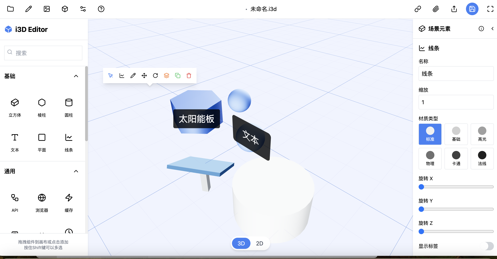

# 3D-Editor



一款开箱即用的3D可视化编辑器模版，支持扩展和二次开发.


## 技术架构

i3D Editor采用了组件化、模块化的架构设计，主要分为以下几个部分：

### 架构图

```
i3D Editor
├── 核心模块
│   ├── 编辑器界面 (EditorInterface)
│   ├── 3D场景渲染 (Canvas, SceneObject)
│   └── 状态管理 (ElementStore)
├── 功能模块
│   ├── 组件库 (LeftSidebar)
│   ├── 属性编辑 (RightSidebar)
│   ├── 工具栏 (TopToolbar, FloatingToolbar)
│   └── 历史记录 (History Management)
└── 工具模块
├── 位置追踪 (ElementPositionTracker)
├── 拖拽系统 (Drag and Drop)
└── 快捷键管理 (Keyboard Shortcuts)

```


## 2. 技术栈

### 前端框架与库

- **React 18**: 用于构建用户界面的JavaScript库
- **Next.js 14**: React框架，提供服务端渲染、路由等功能
- **TypeScript**: 静态类型检查的JavaScript超集
- **Three.js**: 3D图形库，用于在浏览器中渲染3D场景
- **React Three Fiber**: Three.js的React渲染器
- **React Three Drei**: Three.js的React组件集合
- **Tailwind CSS**: 实用优先的CSS框架
- **Lucide React**: 现代图标库

### 状态管理与工具

- **Zustand**: 轻量级状态管理库
- **UUID**: 用于生成唯一标识符
- **HTML5 Drag and Drop API**: 原生拖放功能实现


关注【趣谈前端】公众号，获取更多技术干货，项目最新进展，和开源实践。

##### 联系作者wx：cxzk_168

## 在线办公相关解决方案

1. [flowmix/docx多模态文档编辑器](https://flowmix.turntip.cn)
2. [灵语AI文档](https://mindlink.turntip.cn)
3. [H5-Dooring智能零代码平台](https://github.com/MrXujiang/h5-Dooring)


